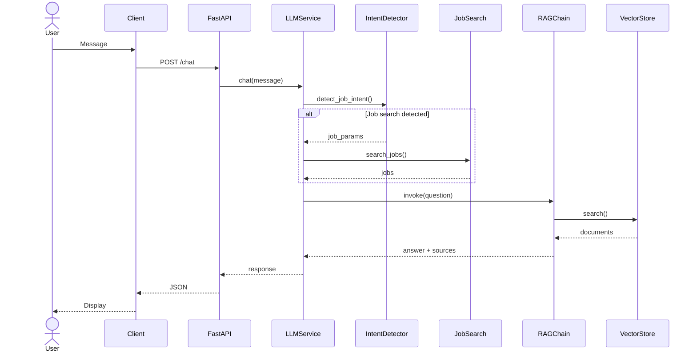
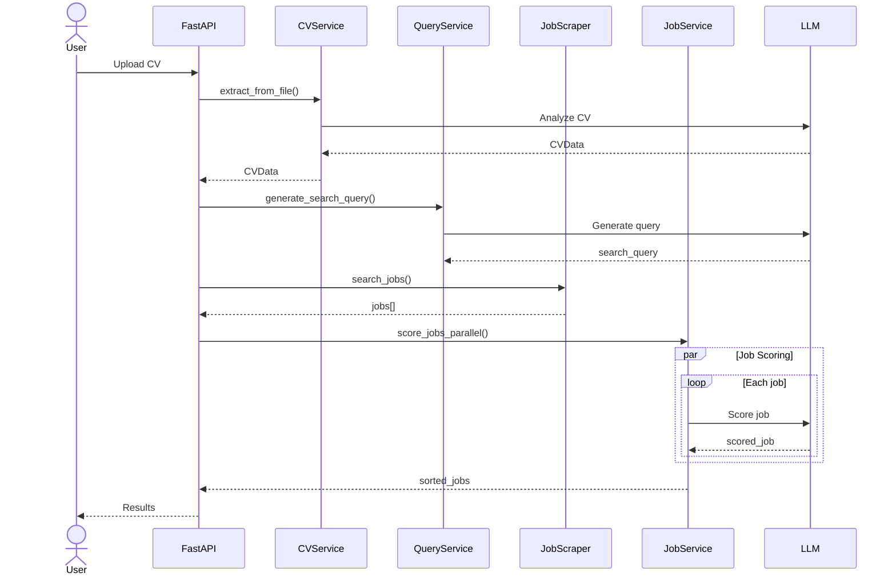

# Job Engine - Chatbot Assistant

> Assistant virtuel intelligent pour la recherche d'emploi avec analyse de CV, recherche contextuelle et conversation naturelle.

[](https://www.python.org/downloads/)
[](https://fastapi.tiangolo.com/)
[](https://www.langchain.com/)
[](LICENSE)

## 🎯 Vue d'ensemble

Job Engine est une plateforme complète pour la recherche d'emploi intelligente, composée de deux services principaux :

### 🗣️ Chatbot (Port 8000)
Assistant conversationnel alimenté par l'IA qui combine :
- 💬 **Chat intelligent** avec mémoire contextuelle (LangChain + OpenAI)
- 🔍 **Recherche d'emploi** automatisée via conversation naturelle
- 🧠 **RAG (Retrieval Augmented Generation)** pour réponses contextuelles
- 📚 **Base de connaissances** vectorielle (ChromaDB)

### 💼 API Job Matching (Port 8001)
API spécialisée pour l'analyse de CV et le matching d'offres :
- 📄 **Analyse de CV** automatique (PDF, DOCX, images)
- 🔍 **Recherche d'offres** basée sur le profil extrait
- 🎯 **Scoring intelligent** des offres selon plusieurs critères
- 📍 **Calcul des distances** domicile-travail (Google Maps)

## ✨ Fonctionnalités principales

### Chat & IA
- Chat conversationnel avec mémoire de session
- Détection automatique des intentions de recherche d'emploi
- Base de connaissances vectorielle (ChromaDB)
- Support multi-sessions utilisateurs

### Recherche d'emploi
- Recherche automatique déclenchée par conversation naturelle
- API de recherche avancée avec filtres multiples
- Analyse et extraction de CV (PDF, DOCX, TXT)
- Scoring et classement intelligent des offres
- Calcul des temps de trajet domicile-travail

### API & Intégration
- API REST complète avec documentation Swagger
- Support frontend (Next.js)
- Exemples d'intégration prêts à l'emploi

## 🚀 Installation rapide

### Prérequis
- Python 3.9+
- **Pour le Chatbot** :
  - Clé API OpenAI (requis)
  - Clé API RapidAPI (optionnel, pour recherche d'emploi)
- **Pour l'API Job Matching** :
  - Clé API Groq (requis)
  - Clé API RapidAPI JSearch (requis)
  - Clé API Google Maps (optionnel, pour calcul des distances)

### Installation

```bash
# 1. Cloner le projet
git clone https://github.com/morningstar-47/job-scrape-engine.git
cd job-scrape-engine

# 2. Créer l'environnement virtuel
python -m venv venv
source venv/bin/activate  # Windows: venv\Scripts\activate

# 3. Installer les dépendances pour chaque service

# Pour le Chatbot
cd chatbot-main
pip install -r requirements.txt
cd ..

# Pour l'API Job Matching
cd api-job
pip install -r requirements.txt
cd ..

# 4. Configurer les variables d'environnement
# Créer les fichiers .env dans chaque dossier de service
# Voir la section "Configuration .env" ci-dessous
```

### Configuration `.env`

#### Pour le Chatbot (chatbot-main/.env)

```bash
# Obligatoire
OPENAI_API_KEY=votre_cle_openai

# Optionnel (pour recherche d'emploi)
RAPIDAPI_KEY=votre_cle_rapidapi

# Configuration par défaut (modifiable)
OPENAI_MODEL=gpt-3.5-turbo
TEMPERATURE=0.7
MAX_TOKENS=1000
CHROMA_PERSIST_DIRECTORY=./chroma_db
RETRIEVER_K=4
```

#### Pour l'API Job Matching (api-job/.env)

```bash
# Obligatoires
GROQ_API_KEY=votre_cle_groq
JOB_SCRAPPER_API_KEY=votre_cle_rapidapi_jsearch

# Optionnel (pour calcul des distances)
GOOGLE_MAPS_API_KEY=votre_cle_google_maps

# Configuration des modèles (optionnel)
CV_EXTRACTION_MODEL=openai/gpt-oss-20b
IMAGE_ANALYSIS_MODEL=meta-llama/llama-4-scout-17b-16e-instruct
JOB_SCORING_MODEL=openai/gpt-oss-120b
QUERY_GENERATION_MODEL=openai/gpt-oss-20b

# Limites (optionnel)
MAX_FILE_SIZE=10485760  # 10MB en octets
MAX_JOBS_TO_SCORE=50
MAX_PARALLEL_SCORING=5
```

### Démarrage

Ce projet contient deux services principaux qui peuvent être démarrés indépendamment :

#### 🗣️ Chatbot (chatbot-main)

Le chatbot conversationnel avec recherche d'emploi intégrée :

```bash
# Depuis la racine du projet
cd chatbot-main

# Installer les dépendances si ce n'est pas déjà fait
pip install -r requirements.txt

# Démarrer le serveur
uvicorn app.main:app --reload --host 0.0.0.0 --port 8000
```

Le chatbot sera accessible sur :
- 🌐 **API** : http://localhost:8000
- 📚 **Documentation Swagger** : http://localhost:8000/docs
- 📖 **Documentation ReDoc** : http://localhost:8000/redoc
- ❤️ **Health Check** : http://localhost:8000/health

**Variables d'environnement requises** (dans `chatbot-main/.env`) :
```bash
OPENAI_API_KEY=votre_cle_openai
RAPIDAPI_KEY=votre_cle_rapidapi  # Optionnel, pour recherche d'emploi
```

#### 💼 API Job Matching (api-job)

L'API d'analyse de CV et de matching d'offres d'emploi :

```bash
# Depuis la racine du projet
cd api-job

# Installer les dépendances si ce n'est pas déjà fait
pip install -r requirements.txt

# Démarrer le serveur (version 3.0.0 dans app/main.py)
python -m uvicorn app.main:app --reload --host 0.0.0.0 --port 8001
# OU depuis le dossier api-job/app
cd app
python -m uvicorn main:app --reload --host 0.0.0.0 --port 8001
```

L'API Job Matching sera accessible sur :
- 🌐 **API** : http://localhost:8001
- 📚 **Documentation Swagger** : http://localhost:8001/docs
- 📖 **Documentation ReDoc** : http://localhost:8001/redoc
- ❤️ **Health Check** : http://localhost:8001/health

**Variables d'environnement requises** (dans `api-job/.env`) :
```bash
GROQ_API_KEY=votre_cle_groq
JOB_SCRAPPER_API_KEY=votre_cle_rapidapi_jsearch
GOOGLE_MAPS_API_KEY=votre_cle_google_maps  # Optionnel, pour calcul des distances
```

#### 🚀 Démarrage des deux services

Pour démarrer les deux services simultanément, ouvrez deux terminaux :

**Terminal 1 - Chatbot :**
```bash
cd chatbot-main
uvicorn app.main:app --reload --host 0.0.0.0 --port 8000
```

**Terminal 2 - API Job :**
```bash
cd api-job
python -m uvicorn app.main:app --reload --host 0.0.0.0 --port 8001
```

> **Note** : Les deux services peuvent fonctionner indépendamment. Le chatbot utilise sa propre recherche d'emploi intégrée, tandis que l'API Job Matching est spécialisée dans l'analyse de CV et le scoring d'offres.

## 📋 Utilisation

### Chat conversationnel

```python
import requests

response = requests.post("http://localhost:8000/chat", json={
    "message": "Je cherche un emploi de développeur Python à Paris",
    "session_id": "user-123"
})
print(response.json())
```

Le bot détecte automatiquement l'intention et effectue la recherche d'emploi !

### Recherche d'emploi directe

```python
response = requests.get("http://localhost:8000/jobs/search", params={
    "query": "développeur Python",
    "country": "France",
    "city": "Paris",
    "language": "fr"
})
```

### Analyse de CV + Matching (API Job Matching)

**Note** : Cette fonctionnalité nécessite que l'API Job Matching soit démarrée sur le port 8001.

```python
import requests

# Upload d'un CV et matching automatique avec les offres
files = {"file": open("cv.pdf", "rb")}
response = requests.post(
    "http://localhost:8001/analyze-cv-and-match-jobs",
    files=files,
    params={"num_pages": 2, "max_jobs": 20}
)

data = response.json()
print(f"Trouvé {data['total_jobs_scored']} offres compatibles")
for job in data['scored_jobs'][:5]:  # Top 5
    print(f"{job['job_title']} - Score: {job['score']}")
```

**Formats de CV supportés** : PDF, DOCX, PNG, JPG, JPEG

## 📡 API Endpoints

### 🗣️ Chatbot (Port 8000)

#### Chat
| Méthode | Endpoint | Description |
|---------|----------|-------------|
| `POST` | `/chat` | Envoyer un message |
| `POST` | `/chat/session/{session_id}` | Chat pour session spécifique |
| `GET` | `/chat/session/{session_id}/history` | Historique de conversation |
| `DELETE` | `/chat/session/{session_id}` | Réinitialiser session |

#### Emplois
| Méthode | Endpoint | Description |
|---------|----------|-------------|
| `GET` | `/jobs/search` | Recherche avec filtres avancés |
| `GET` | `/jobs/search/summary` | Recherche avec résumé formaté |
| `GET` | `/jobs/{job_id}` | Détails d'une offre |

#### Base de connaissances
| Méthode | Endpoint | Description |
|---------|----------|-------------|
| `POST` | `/knowledge/upload` | Ajouter documents à la base |

#### Santé
| Méthode | Endpoint | Description |
|---------|----------|-------------|
| `GET` | `/health` | Vérification de l'état de l'application |

### 💼 API Job Matching (Port 8001)

#### Analyse et Matching
| Méthode | Endpoint | Description |
|---------|----------|-------------|
| `POST` | `/analyze-cv-and-match-jobs` | Analyse CV + recherche + scoring d'offres |
| `GET` | `/health` | Vérification de l'état de l'API |

**Paramètres pour `/analyze-cv-and-match-jobs`** :
- `file` (multipart/form-data) : Fichier CV (PDF, DOCX, PNG, JPG, JPEG)
- `num_pages` (query, optionnel) : Nombre de pages de résultats à scraper (défaut: 3)
- `max_jobs` (query, optionnel) : Nombre maximum d'offres à scorer (défaut: toutes)

## 📁 Structure du projet

```
job-scrape-engine/
├── chatbot-main/                    # Service Chatbot (Port 8000)
│   ├── app/
│   │   ├── main.py                  # Point d'entrée FastAPI
│   │   ├── config.py                # Configuration globale
│   │   ├── models/                  # Modèles Pydantic
│   │   ├── services/                # Logique métier
│   │   │   ├── llm_service.py      # Service LLM principal
│   │   │   ├── memory_service.py   # Gestion sessions
│   │   │   ├── vector_store.py     # Base vectorielle
│   │   │   ├── job_search_service.py # Recherche emplois
│   │   │   └── job_intent_detector.py # Détection intentions
│   │   └── routers/                 # Routes API
│   │       ├── chat.py
│   │       └── jobs.py
│   ├── data/knowledge_base/         # Documents base de connaissances
│   ├── examples/                    # Exemples d'utilisation
│   ├── requirements.txt
│   └── README.md
│
├── api-job/                         # Service API Job Matching (Port 8001)
│   ├── app/
│   │   ├── main.py                  # Point d'entrée FastAPI v3.0.0
│   │   ├── config/
│   │   │   └── settings.py         # Configuration Pydantic Settings
│   │   ├── models/                  # Modèles Pydantic
│   │   ├── services/                # Services métier
│   │   │   ├── cv_service.py       # Extraction CV
│   │   │   ├── query_service.py    # Génération requêtes
│   │   │   └── job_service.py      # Scoring offres
│   │   └── utils/                   # Utilitaires
│   ├── main.py                      # Ancienne version (v2.0.0)
│   ├── cv_reader.py                 # Lecteur CV
│   ├── get_job_offers.py            # Scraping offres
│   ├── utils.py                     # Utilitaires
│   ├── template_prompt/             # Templates prompts LLM
│   ├── requirements.txt
│   └── README.md
│
├── email_dispenser/                  # Service email (optionnel)
├── LICENSE
└── README.md                         # Ce fichier
```

## 💡 Exemples d'utilisation

### 🗣️ Chatbot

#### Tester avec Python

```bash
cd chatbot-main

# Chat général
python examples/example_usage.py

# Recherche d'emploi via API
python examples/example_job_search.py

# Test détection automatique dans le chat
python examples/test_job_search_in_chat.py
```

#### Tester avec cURL

```bash
# Envoyer un message au chatbot
curl -X POST "http://localhost:8000/chat" \
  -H "Content-Type: application/json" \
  -d '{"message": "Je cherche un emploi de développeur Python à Paris", "session_id": "test-123"}'

# Recherche d'emploi directe
curl "http://localhost:8000/jobs/search?query=développeur%20Python&country=France&city=Paris&language=fr"
```

### 💼 API Job Matching

#### Tester avec cURL

```bash
cd api-job

# Analyser un CV et matcher avec des offres
curl -X POST "http://localhost:8001/analyze-cv-and-match-jobs?num_pages=2&max_jobs=10" \
  -F "file=@/chemin/vers/votre/cv.pdf"
```

#### Tester avec Python

```python
import requests

# Analyser un CV et obtenir les offres matchées
url = "http://localhost:8001/analyze-cv-and-match-jobs"
files = {"file": open("cv.pdf", "rb")}
params = {"num_pages": 2, "max_jobs": 10}

response = requests.post(url, files=files, params=params)
data = response.json()

print(f"CV analysé : {data['cv_data']['title']}")
print(f"Requête de recherche : {data['search_query']}")
print(f"Trouvé {data['total_jobs_scored']} offres compatibles")

# Afficher le top 5
for job in data['scored_jobs'][:5]:
    print(f"\n{job['job_title']} - Score: {job['score']}")
    print(f"  Entreprise: {job['employer_name']}")
    print(f"  Ville: {job['job_city']}")
    print(f"  Distance: {job['distance_between_cities']} minutes")
```

### Phrases déclenchant la recherche d'emploi

Le bot détecte automatiquement ces types de requêtes :
- "Je cherche un emploi de développeur Python en France"
- "Trouve-moi des postes de data scientist en télétravail"
- "Y a-t-il des offres d'ingénieur logiciel à Paris ?"
- "Recherche des emplois de designer UX remote"

### Frontend

Ouvrez `chatbot-main/examples/frontend_example.html` dans votre navigateur pour une interface web fonctionnelle, ou consultez **[FRONTEND_API_DOCS.md](chatbot-main/FRONTEND_API_DOCS.md)** pour intégrer dans React/Vue.js/vanilla JS.

## 🏗️ Architecture

### Diagramme de flux - Chat



### Diagramme de flux - Analyse CV



## 🛠️ Technologies

### 🗣️ Chatbot
- **[LangChain](https://www.langchain.com/)** - Framework pour applications LLM
- **[FastAPI](https://fastapi.tiangolo.com/)** - Framework web moderne
- **[OpenAI](https://openai.com/)** - Modèles GPT
- **[ChromaDB](https://www.trychroma.com/)** - Base de données vectorielle
- **[Pydantic](https://docs.pydantic.dev/)** - Validation de données
- **[RapidAPI JSearch](https://rapidapi.com/)** - API recherche d'emploi

### 💼 API Job Matching
- **[FastAPI](https://fastapi.tiangolo.com/)** - Framework web moderne
- **[Groq](https://groq.com/)** - LLM haute performance pour extraction et scoring
- **[RapidAPI JSearch](https://rapidapi.com/)** - API recherche d'emploi
- **[Google Maps API](https://developers.google.com/maps)** - Calcul des distances
- **[PyPDF2](https://pypdf2.readthedocs.io/)** - Extraction PDF
- **[python-docx](https://python-docx.readthedocs.io/)** - Extraction DOCX
- **[Pydantic Settings](https://docs.pydantic.dev/latest/concepts/pydantic_settings/)** - Gestion de configuration

## ⚙️ Configuration avancée

### Chatbot (chatbot-main/.env)

Variables d'environnement disponibles :

```bash
# Application
APP_NAME=Job Engine - Chatbot Assistant
APP_VERSION=1.0.0
DEBUG=False

# OpenAI
OPENAI_API_KEY=sk-...
OPENAI_MODEL=gpt-3.5-turbo        # ou gpt-4
TEMPERATURE=0.7                    # 0.0-1.0
MAX_TOKENS=1000

# RapidAPI
RAPIDAPI_KEY=votre_cle

# ChromaDB
CHROMA_PERSIST_DIRECTORY=./chroma_db

# RAG
RETRIEVER_K=4                      # Nombre de documents récupérés
```

### API Job Matching (api-job/.env)

Variables d'environnement disponibles :

```bash
# API Keys (obligatoires)
GROQ_API_KEY=votre_cle_groq
JOB_SCRAPPER_API_KEY=votre_cle_rapidapi_jsearch
GOOGLE_MAPS_API_KEY=votre_cle_google_maps  # Optionnel

# Modèles LLM
CV_EXTRACTION_MODEL=openai/gpt-oss-20b
IMAGE_ANALYSIS_MODEL=meta-llama/llama-4-scout-17b-16e-instruct
JOB_SCORING_MODEL=openai/gpt-oss-120b
QUERY_GENERATION_MODEL=openai/gpt-oss-20b

# Limites
MAX_FILE_SIZE=10485760              # 10MB en octets
MAX_JOBS_TO_SCORE=50                # Nombre max d'offres à scorer
MAX_PARALLEL_SCORING=5              # Nombre d'offres scorées en parallèle

# CORS
CORS_ORIGINS=["*"]                  # Ou liste spécifique d'origines

# Environnement
ENVIRONMENT=development              # development, staging, production
DEBUG=False
```

## 🤝 Contribution

Les contributions sont les bienvenues ! N'hésitez pas à :
1. Fork le projet
2. Créer une branche (`git checkout -b feature/amelioration`)
3. Commit vos changements (`git commit -m 'Ajout fonctionnalité'`)
4. Push vers la branche (`git push origin feature/amelioration`)
5. Ouvrir une Pull Request

## 📝 Licence

Ce projet est sous licence MIT. Voir le fichier [LICENSE](LICENSE) pour plus de détails.

## 📞 Support

- 📚 **Documentation** : Consultez les docs dans `/docs`
- 🐛 **Issues** : Signalez les bugs via GitHub Issues
- 💬 **Questions** : Ouvrez une discussion dans GitHub Discussions

---

**Développé avec ❤️ en utilisant LangChain et FastAPI**
