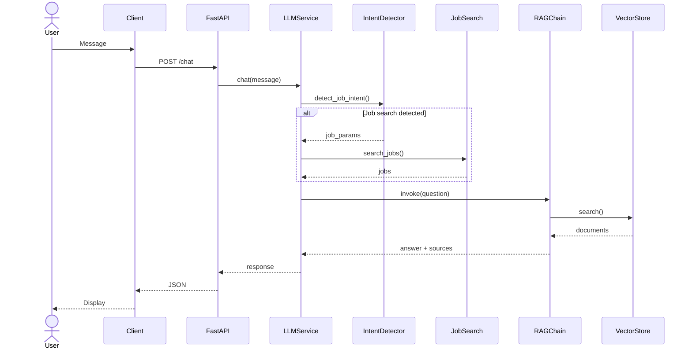
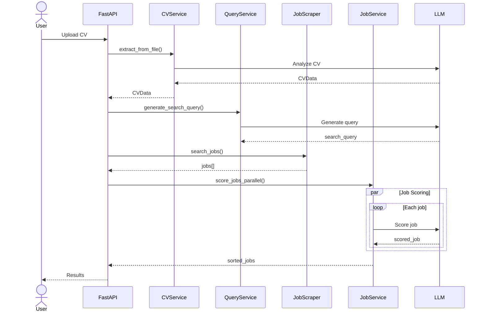

# Job Engine - Chatbot Assistant

> Assistant virtuel intelligent pour la recherche d'emploi avec analyse de CV, recherche contextuelle et conversation naturelle.

[](https://www.python.org/downloads/)
[](https://fastapi.tiangolo.com/)
[](https://www.langchain.com/)
[](LICENSE)

## 🎯 Vue d'ensemble

Job Engine est un assistant conversationnel alimenté par l'IA qui combine :
- 💬 **Chat intelligent** avec mémoire contextuelle (LangChain + OpenAI)
- 🔍 **Recherche d'emploi** automatisée via RapidAPI JSearch
- 📄 **Analyse de CV** et matching intelligent avec les offres
- 🧠 **RAG (Retrieval Augmented Generation)** pour réponses contextuelles
- 🎯 **Scoring automatique** des offres selon votre profil

## ✨ Fonctionnalités principales

### Chat & IA
- Chat conversationnel avec mémoire de session
- Détection automatique des intentions de recherche d'emploi
- Base de connaissances vectorielle (ChromaDB)
- Support multi-sessions utilisateurs

### Recherche d'emploi
- Recherche automatique déclenchée par conversation naturelle
- API de recherche avancée avec filtres multiples
- Analyse et extraction de CV (PDF, DOCX, TXT)
- Scoring et classement intelligent des offres
- Calcul des temps de trajet domicile-travail

### API & Intégration
- API REST complète avec documentation Swagger
- Support frontend (Next.js)
- Exemples d'intégration prêts à l'emploi

## 🚀 Installation rapide

### Prérequis
- Python 3.9+
- Clé API OpenAI (requis)
- Clé API RapidAPI (optionnel, pour recherche d'emploi)

### Installation

```bash
# 1. Cloner le projet
git clone <repository-url>
cd chatbot-langchain

# 2. Créer l'environnement virtuel
python -m venv venv
source venv/bin/activate  # Windows: venv\Scripts\activate

# 3. Installer les dépendances
pip install -r requirements.txt

# 4. Configurer les variables d'environnement
cp .env.example .env
# Éditer .env avec vos clés API
```

### Configuration `.env`

```bash
# Obligatoire
OPENAI_API_KEY=votre_cle_openai

# Optionnel (pour recherche d'emploi)
RAPIDAPI_KEY=votre_cle_rapidapi

# Configuration par défaut (modifiable)
OPENAI_MODEL=gpt-3.5-turbo
TEMPERATURE=0.7
MAX_TOKENS=1000
```

### Démarrage

```bash
uvicorn app.main:app --reload
```

Accédez ensuite à :
- 📚 **Documentation Swagger** : http://localhost:8000/docs
- 📖 **Documentation ReDoc** : http://localhost:8000/redoc

## 📋 Utilisation

### Chat conversationnel

```python
import requests

response = requests.post("http://localhost:8000/chat", json={
    "message": "Je cherche un emploi de développeur Python à Paris",
    "session_id": "user-123"
})
print(response.json())
```

Le bot détecte automatiquement l'intention et effectue la recherche d'emploi !

### Recherche d'emploi directe

```python
response = requests.get("http://localhost:8000/jobs/search", params={
    "query": "développeur Python",
    "country": "France",
    "city": "Paris",
    "language": "fr"
})
```

### Analyse de CV + Matching

```python
files = {"file": open("cv.pdf", "rb")}
response = requests.post(
    "http://localhost:8000/analyze-cv-and-match-jobs",
    files=files,
    data={"num_pages": 2, "max_jobs": 20}
)
```

## 📡 API Endpoints

### Chat
| Méthode | Endpoint | Description |
|---------|----------|-------------|
| `POST` | `/chat` | Envoyer un message |
| `POST` | `/chat/session/{session_id}` | Chat pour session spécifique |
| `GET` | `/chat/session/{session_id}/history` | Historique de conversation |
| `DELETE` | `/chat/session/{session_id}` | Réinitialiser session |

### Emplois
| Méthode | Endpoint | Description |
|---------|----------|-------------|
| `GET` | `/jobs/search` | Recherche avec filtres avancés |
| `GET` | `/jobs/search/summary` | Recherche avec résumé formaté |
| `GET` | `/jobs/{job_id}` | Détails d'une offre |
| `POST` | `/analyze-cv-and-match-jobs` | Analyse CV + matching |

### Base de connaissances
| Méthode | Endpoint | Description |
|---------|----------|-------------|
| `POST` | `/knowledge/upload` | Ajouter documents à la base |

## 📁 Structure du projet

```
chatbot-langchain/
├── app/
│   ├── main.py                      # Point d'entrée FastAPI
│   ├── config.py                    # Configuration globale
│   ├── models/                      # Modèles Pydantic
│   ├── services/                    # Logique métier
│   │   ├── llm_service.py          # Service LLM principal
│   │   ├── memory_service.py       # Gestion sessions
│   │   ├── vector_store.py         # Base vectorielle
│   │   ├── job_search_service.py   # Recherche emplois
│   │   ├── job_intent_detector.py  # Détection intentions
│   │   ├── cv_service.py           # Analyse CV
│   │   └── job_service.py          # Scoring emplois
│   └── routers/                     # Routes API
│       ├── chat.py
│       └── jobs.py
├── data/knowledge_base/             # Documents base de connaissances
├── examples/                        # Exemples d'utilisation
│   ├── example_usage.py            # Exemples API généraux
│   ├── example_job_search.py       # Exemples recherche emploi
│   ├── test_job_search_in_chat.py  # Test détection auto
│   └── frontend_example.html       # Interface web exemple
├── requirements.txt
├── README.md
└── FRONTEND_API_DOCS.md            # Doc intégration frontend
```

## 💡 Exemples d'utilisation

### Tester avec Python

```bash
# Chat général
python examples/example_usage.py

# Recherche d'emploi via API
python examples/example_job_search.py

# Test détection automatique dans le chat
python examples/test_job_search_in_chat.py
```

### Phrases déclenchant la recherche d'emploi

Le bot détecte automatiquement ces types de requêtes :
- "Je cherche un emploi de développeur Python en France"
- "Trouve-moi des postes de data scientist en télétravail"
- "Y a-t-il des offres d'ingénieur logiciel à Paris ?"
- "Recherche des emplois de designer UX remote"

### Frontend

Ouvrez `chatbot-main/examples/frontend_example.html` dans votre navigateur pour une interface web fonctionnelle, ou consultez **[FRONTEND_API_DOCS.md](chatbot-main/FRONTEND_API_DOCS.md)** pour intégrer dans React/Vue.js/vanilla JS.

## 🏗️ Architecture

### Diagramme de flux - Chat



### Diagramme de flux - Analyse CV



## 🛠️ Technologies

- **[LangChain](https://www.langchain.com/)** - Framework pour applications LLM
- **[FastAPI](https://fastapi.tiangolo.com/)** - Framework web moderne
- **[OpenAI](https://openai.com/)** - Modèles GPT
- **[ChromaDB](https://www.trychroma.com/)** - Base de données vectorielle
- **[Pydantic](https://docs.pydantic.dev/)** - Validation de données
- **[RapidAPI JSearch](https://rapidapi.com/)** - API recherche d'emploi

## ⚙️ Configuration avancée

Variables d'environnement disponibles dans `.env` :

```bash
# Application
APP_NAME=Job Engine - Chatbot Assistant
APP_VERSION=1.0.0
DEBUG=False

# OpenAI
OPENAI_API_KEY=sk-...
OPENAI_MODEL=gpt-3.5-turbo        # ou gpt-4
TEMPERATURE=0.7                    # 0.0-1.0
MAX_TOKENS=1000

# RapidAPI
RAPIDAPI_KEY=votre_cle

# ChromaDB
CHROMA_PERSIST_DIRECTORY=./chroma_db

# RAG
RETRIEVER_K=4                      # Nombre de documents récupérés
```

## 🤝 Contribution

Les contributions sont les bienvenues ! N'hésitez pas à :
1. Fork le projet
2. Créer une branche (`git checkout -b feature/amelioration`)
3. Commit vos changements (`git commit -m 'Ajout fonctionnalité'`)
4. Push vers la branche (`git push origin feature/amelioration`)
5. Ouvrir une Pull Request

## 📝 Licence

Ce projet est sous licence MIT. Voir le fichier [LICENSE](LICENSE) pour plus de détails.

## 📞 Support

- 📚 **Documentation** : Consultez les docs dans `/docs`
- 🐛 **Issues** : Signalez les bugs via GitHub Issues
- 💬 **Questions** : Ouvrez une discussion dans GitHub Discussions

---

**Développé avec ❤️ en utilisant LangChain et FastAPI**
